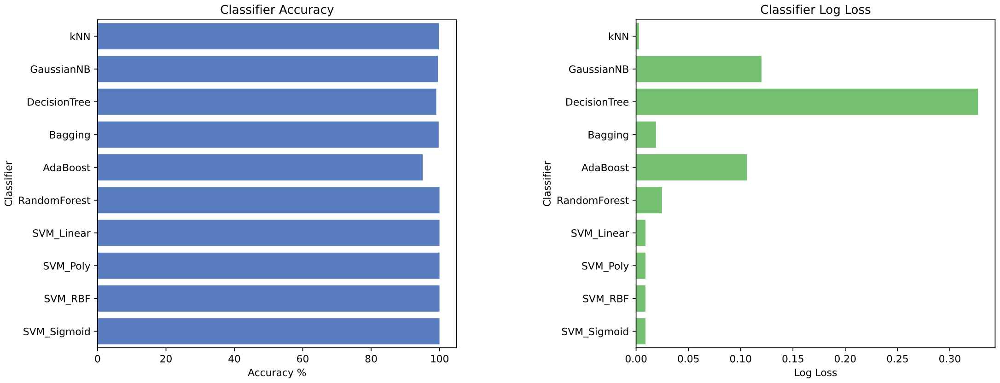
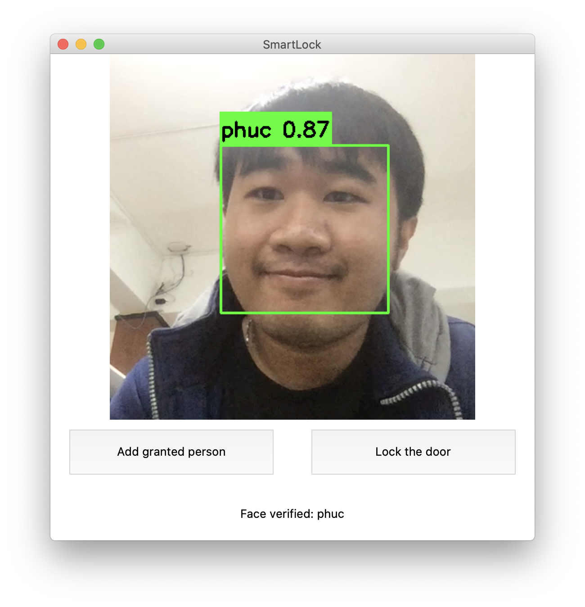
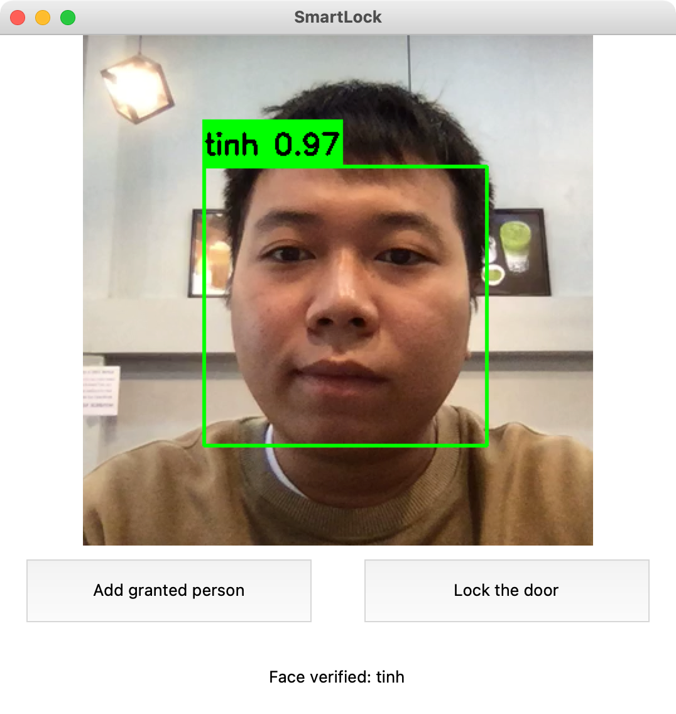

# Smart lock using facial recognition on top of RaspberryPi 3+ models
---

## What we are doing:
+ We researched for efficient algorithm for face classification, end up with SVM-RBF

Steps to reproduce:
Follow ``experiments.ipynb`` to execute tests and see SVM-RBF actual configs 

+ We built client-server model for applying model into practice:
Setup:

1. Install requirements:
`` pip3 install -r requirements.txt ``

2. Run server:

```
cd server
python3 server.py
```

3. Run client:
```
cd ../client
GPIO=true python3 client.py
```

**Caution:** 
- ``GPIO=true`` will requires package RPi.GPIO to be installed
- We offers config in ``client.py``, please have a look at the script for proper config to make script works on your environment

Some screenshots:



---
## Who we are:
+ vinhphuctadang@gmail.com
+ dcongtinh@gmail.com

Please leave us feedback if there are some issues with this repo. 
Enjoy your day!!!